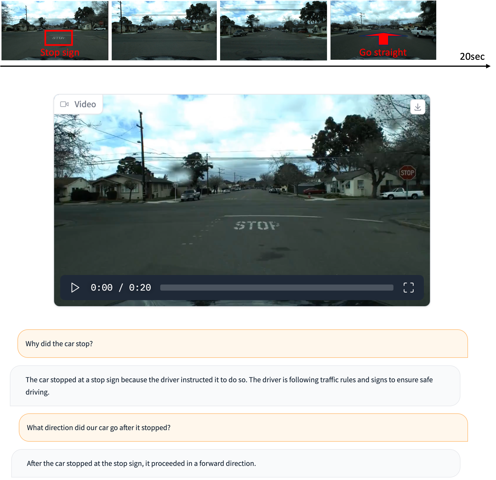

<p align="center" width="100%">

</p>

# VLAAD: Vision-and-Language-Assistant-for-Autonomous-Driving


Vision-and-Language-Assistant-for-Autonomous-Driving(VLAAD), enabling communication between human driver and vehicle. 
This repo contains:

- The **64K of instruction-following data** used for fine-tuning the model.
- The code for generating data, fine-tune the model.
- The fine-tuned model weights.

## Overview

Human-vehicle interaction and interpretability have not been addressed so far, especially not through natural language, while the decision making procedures of agents should be easily understood for our safety and transparency.

With this aim, we first introduce multimodal-llm to self-driving domain by fine-tuning Video-LLaMA[1] with our instruction-following data generated from driving scene videos.
VLAAD can understand driving scene, such as road traffic, dynamic objects, and car maneuver, by utilizing its reasoning capabilites on visual representations.

We also built the first instruction-following dataset for self-driving, mainly for conversation, description, and complex reasoning tasks.
The code for generating instruction-tuning dataset from front-view camera videos and their short annotations is also included to be used in other works too.

Currently, VLAAD is fine-tuned on LLaMA-2-7B with Video-Qformer and only utilzed our 64K instruction-tuning dataset generated by GPT-4.
We're still developing VLAAD while generating high-quality dataset and modification of the architecture, so this repo will continue to be updated.

Please keep an eye on our future release!

[1]: Video-LLaMA: An Instruction-tuned Audio-Visual Language Model for Video Understanding. Hang Zhang, Xin Li, Lidong Bing. https://arxiv.org/abs/2306.02858

## Example Output
Example output of 20 seconds long video 
- Situation 1: stopped at the road stop sign and then move forward.
<p align="center" width="100%">

</p>
  
- Situation 2: decelerated and stopped in front of crossing pedestrians.
<p align="center" width="100%">

</p>

## Data Release
  
| Base Dataset  | Instruction Dataset |      Size    |   Released  |
|:-------------:|:-------------------:|:-------------:|:----------:|
| [BDD,](https://bdd-data.berkeley.edu/)  [BDD-X](https://github.com/JinkyuKimUCB/explainable-deep-driving)  | [- Detailed description 3K](./data/BDD_train_data/BDD-Instruct-desc-v3.json)  [- Complex reasoning 35K](./data/BDD_train_data/BDD-instruct-reasoning-v1.json)  | 40 seconds long videos with textual expalnation and description (BDD-X: 6,970, BDD: 100K videos) | O |
| [HAD HRI](https://usa.honda-ri.com/had)  | [- Detailed description 1K](./data/HAD_train_data/HAD-instruct-description-v1.json)  [- Complex reasoning 11K](./data/HAD_train_data/HAD-instruct_reasoning_v1.json)  [- Conversation 12K](./data/HAD_train_data/HAD-instruct-conversation_v1.json)  | 5,850 videos of 20 seconds long | O |
| [DRAMA](https://usa.honda-ri.com/drama)   |  - | 17,785 scenario clips with 2 seconds length | released soon |
| [LOKI](https://usa.honda-ri.com/loki)   |  -  | 644 scenarios with average 12.6 seconds length | released soon |


Example of VLAAD instruction dataset

 ```
 ### Complex reasoning
 
 {
    "video_id": "test0001.mp4", 
    "QA": {
        "q": "How did the car handle the oncoming traffic before making the left turn?", 
        "a": "The ego-car detected oncoming traffic and stopped to wait until the lane was clear. It maintained the stopped position for quite some time and only proceeded to turn left when it was safe to do so. "
    }
 }


 ### Detailed description

 {
    "video_id": "test0003.mp4",
    "QA": {
        "q": "Can you describe the series of events that happened while driving in the city?",
        "a": "While on the road, the ego-car had to make a right turn onto a major street. Just before attempting the turn, a pedestrian crossed its path, which the car noticed for a brief moment. As it initiated the right turn, the car became aware of a crossing vehicle. Simultaneously, the traffic light turned red, causing the car to pause its maneuver and wait. For a duration after noticing the red light, the car came to a complete stop. Once the light turned green again, the car proceeded with its right turn and journeyed down the major street."
    }
 }

 ### Conversation

 {
    "video_id": "test0003.mp4",
    "QA": {
        "q": "Can you describe the series of events that happened while driving in the city?",
        "a": "While on the road, the ego-car had to make a right turn onto a major street. Just before attempting the turn, a pedestrian crossed its path, which the car noticed for a brief moment. As it initiated the right turn, the car became aware of a crossing vehicle. Simultaneously, the traffic light turned red, causing the car to pause its maneuver and wait. For a duration after noticing the red light, the car came to a complete stop. Once the light turned green again, the car proceeded with its right turn and journeyed down the major street."
    }
 }
 ```

## Create Visual Instruction Data for Self-Driving

- Download original video clips from [BDD](https://bdd-data.berkeley.edu/) and [HAD HRI](https://usa.honda-ri.com/had) after signing the data license agreement.
- Download augmented captions [BDD-captions.json](./instruct-data/BDD/BDD-captions.json) and [HAD-captions.json](./instruct-data/HAD/HAD-captions.json). These are generated by combining annotations and bouding boxes from the base dataset to be injected as input of GPT-4.

#### 1. Install requirements
```
pip3 install -r requirements.txt
```

#### 2. Set OpenAI API Key
1. Set it in a .env file (Recommended)
```
OPENAI_API_KEY=sk-
```
2. Set it in code
```
openai.api_key = "sk-"
```

#### 3. Run
```
cd instruct-data
python3 generate-instructions.py
```

## Fine-tuning

We fine-tune our models following the procedure of [Video-llama](https://github.com/DAMO-NLP-SG/Video-LLaMA). 
To reproduce our fine-tuning runs please refer to environment setting of video-llama.

Fine-tuned checkpoints will soon be released.

### Citation

Please cite the repo if you use the data or code in this repo.

```
@misc{vlaad,
  author = {SungYeon Park, Minjae Lee, Jihyuk Kang, Hahyeon Choi, Yoonah Park, Juhwan Cho, Adam Lee},
  title = {VLAAD: Vision-and-Language-Assistant-for-Autonomous-Driving},
  year = {2023},
  publisher = {GitHub},
  journal = {GitHub repository},
  howpublished = {\url{https://github.com/sungyeonparkk/vision-assistant-for-driving}},
}
```

You should also cite the original Video-LLaMA paper [1].

### Acknowledgements

- [Video-LLaMA](https://github.com/DAMO-NLP-SG/Video-LLaMA): Thank you for the codebase and prior work for video-understanding in LLM.
- [Transportation Research Lab](https://trlab-snu.github.io/) at Seoul National University: Thank you for funding and advising this project.